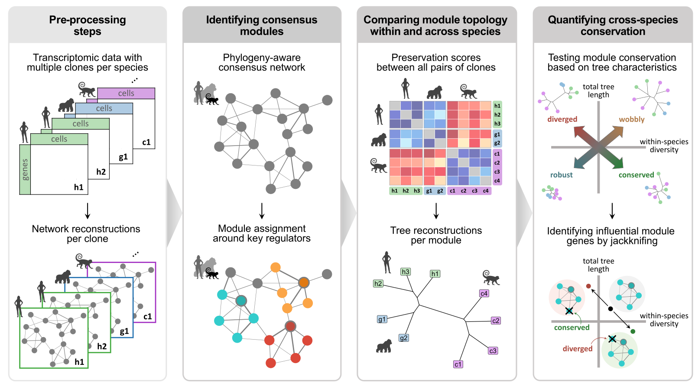

# CroCoNet analyses

This repository contains the code to reproduce all analyses in the
manuscript

### **CroCoNet: a quantitative approach for comparing gene regulatory networks across species**

by Anita Térmeg, Johanna Geuder, Vladyslav Storozhuk, Zane Kliesmete,
Fiona C. Edenhofer, Beate Vieth, Philipp Janssen, Ines Hellmann

# 

The data necessary to reproduce this analysis can be found on
ArrayExpress and GEO:

| Accession                   | Dataset          |
|-----------------------------|------------------|
| E-MTAB-XXXXX                | scRNA-seq data   |
| E-MTAB-13373 & E-MTAB-15654 | ATAC-seq data    |
| GSE298717                   | Perturb-seq data |

To be able to smoothly run all analyses, please follow these steps:

1.  Start a new R project in a new directory

2.  Clone this Github repository to a subdirectory “scripts”

3.  Download the linked Zenodo repository to a subdirectory “data”

### 1. Neural differentiation dataset

The main example data throughout the paper is a scRNA-seq dataset
obtained during the early neural differentiation of human, gorilla and
cynomolgus macaque induced pluripotent (iPS) cell lines. The relevant
scripts to analyze this dataset are the following:

<strong>Mapping & QC</strong>

- [Download the reference
  genomes](1.neural_differentiation_dataset/1.1.mapping_and_QC/1.1.1.download_ref_genomes.sh)
- [Create non-human primate annotations using
  Liftoff](1.neural_differentiation_dataset/1.1.mapping_and_QC/1.1.2.run_liftoff.sh)
- [Filter Liftoff
  annotations](1.neural_differentiation_dataset/1.1.mapping_and_QC/1.1.3.filter_liftoff_gtfs.R)
- [Remove small contigs from the gorGor6 genome for quicker
  mapping](1.neural_differentiation_dataset/1.1.mapping_and_QC/1.1.4.remove_small_contigs.R)
- [Create STAR
  indices](1.neural_differentiation_dataset/1.1.mapping_and_QC/1.1.5.create_STAR_indices.sh)
- [Download FASTQ files of the scRNA-seq
  data](1.neural_differentiation_dataset/1.1.mapping_and_QC/1.1.6.download_FASTQ.sh)
- [Trim poly-A
  tails](1.neural_differentiation_dataset/1.1.mapping_and_QC/1.1.7.trimming.sh)
- [Map reads using the zUMIs
  pipeline](1.neural_differentiation_dataset/1.1.mapping_and_QC/1.1.8.mapping.sh)
  - [YAML for mapping to the hg38
    genome](1.neural_differentiation_dataset/1.1.mapping_and_QC/hg38.yaml)
  - [YAML for mapping to the gorGor6
    genome](1.neural_differentiation_dataset/1.1.mapping_and_QC/gorGor6.yaml)
  - [YAML for mapping to the macFas6
    genome](1.neural_differentiation_dataset/1.1.mapping_and_QC/macFas6.yaml)
- [Download the cell type annotation reference
  dataset](1.neural_differentiation_dataset/1.1.9.download_cell_type_annotation_ref.sh)
- [QC, filtering, normalization, cell type annotation and pseudotime
  inference](1.neural_differentiation_dataset/1.1.10.QC_and_filtering.R)

<strong>Network inference</strong>

- [Prepare input for
  GRNBoost2](1.neural_differentiation_dataset/1.2.network_inference/1.2.1.prepare_data.R)
- [Create GRNBoost2 conda
  environment](1.neural_differentiation_dataset/1.2.network_inference/1.2.2.create_GRNBoost2_env.sh)
- [Infer networks per replicate using
  GRNBoost2](1.neural_differentiation_dataset/1.2.network_inference/1.2.3.run_GRNBoost2.sh)
  - [Network inference worker
    script](1.neural_differentiation_dataset/1.2.network_inference/1.2.3.%20run_GRNBoost2.sh)

<em>Start here to skip computationally intensive steps and jump to core
analysis</em>

<strong>CroCoNet analysis</strong>

- [Module assignment, calculation of preservation scores and
  quantification of cross-species module conservation using
  CroCoNet](1.neural_differentiation_dataset/1.3.CroCoNet_analysis/1.3.1.CroCoNet_analysis.R)

<strong>Additional analyses</strong>

- [Perform CroCoNet analysis using the top50 pruning
  approach](1.neural_differentiation_dataset/1.4.additional_analyses/1.4.1.CroCoNet_analysis_with_top50_pruning.R)
- [Compare results between the dynamic and top50 pruning
  approaches](1.neural_differentiation_dataset/1.4.additional_analyses/1.4.2.dynamic_VS_top50_pruning.R)
- [Perform CroCoNet analysis using cor.adj preservation
  scores](1.neural_differentiation_dataset/1.4.additional_analyses/1.4.3.CroCoNet_analysis_with_cor_adj.R)
- [Compare results between the cor.kIM and cor.adj preservation
  scores](1.neural_differentiation_dataset/1.2.network_inference/1.4.4.cor_kIM_VS_cor_adj.R)

### 2. Validations

To validate the results of the CroCoNet analysis on the neural
differentiation dataset, we used various additional datasets and
databases. These lines of analysis can be reproduced using the following
scripts:

<strong>Regulator interactions and module overlaps</strong>

- [Retrieve protein-protein interactions between the central regulators
  from
  STRINGdb](2.validations/2.1.regulator_interactions_and_module_overlaps/2.1.1.get_regulator_interactions.R)
- [Calculate pairwise module
  overlaps](2.validations/2.1.regulator_interactions_and_module_overlaps/2.1.2.calculate_module_overlaps.R)
- [Test and plot association between regulator interaction and module
  overlap](2.validations/2.1.regulator_interactions_and_module_overlaps/2.1.3.test_association.R)

<strong>Pathway enrichment analysis</strong>

- [Perform Reactome enrichment analysis for each initial, pruned and
  random
  module](2.validations/2.2.pathway_enrichment/2.2.1.run_Reactome.R)
- [Summarize and plot Reactome
  results](2.validations/2.2.pathway_enrichment/2.2.2.summarize_Reactome_results.R)

<strong>Binding site enrichment and divergence</strong>

- [Download FASTQ files of the ATAC-seq
  data](2.validations/2.3.binding_site_enrichment_and_divergence/2.3.1.download_ATAC_seq_FASTQ.sh)
- [Trim
  adapters](2.validations/2.3.binding_site_enrichment_and_divergence/2.3.2.ATAC_seq_trimming.sh)
- [Create bwa-mem2
  indices](2.validations/2.3.binding_site_enrichment_and_divergence/2.3.3.create_bwa_mem2_indices.sh)
- [Map ATAC-seq reads using
  bwa-mem2](2.validations/2.3.binding_site_enrichment_and_divergence/2.3.4.ATAC_seq_mapping.sh)
- [Name-sort BAM
  files](2.validations/2.3.binding_site_enrichment_and_divergence/2.3.5.name_sorting.sh)
- [Call peaks using Genrich without
  blacklists](2.validations/2.3.binding_site_enrichment_and_divergence/2.3.6.peak_calling_without_blacklist.sh)
- [Generate blacklists from broad and high-intensity
  peaks](2.validations/2.3.binding_site_enrichment_and_divergence/2.3.7.create_blacklists.R)
- [Call peaks using Genrich with
  backlists](2.validations/2.3.binding_site_enrichment_and_divergence/2.3.8.peak_calling_with_blacklist.sh)
- [Infer gorilla NPC peaks by liftOver of the human NPC
  peaks](2.validations/2.3.binding_site_enrichment_and_divergence/2.3.9.liftOver_human_NPC_peaks_to_gorGor6.R)
- [Download FASTQ files of the Nanopore
  data](2.validations/2.3.binding_site_enrichment_and_divergence/2.3.10.download_nanopore_FASTQ.sh)
- [Map Nanopore reads using
  minimap2](2.validations/2.3.binding_site_enrichment_and_divergence/2.3.11.nanopore_mapping.sh)
- [Annotate Nanopore
  transcripts](2.validations/2.3.binding_site_enrichment_and_divergence/2.3.12.annotate_nanopore_transcripts.R)
- [Identify active transcriptional start
  sites](2.validations/2.3.binding_site_enrichment_and_divergence/2.3.13.identify_TSS.R)
- [Associate peaks to genes based on
  distance](2.validations/2.3.binding_site_enrichment_and_divergence/2.3.14.associate_peaks_to_gene.R)
- [Retrieve motifs of the central regulators from the JASPAR and IMAGE
  databases](2.validations/2.3.binding_site_enrichment_and_divergence/2.3.15.get_binding_motifs.R)
- [Score motifs of each regulator in the peaks associated to their
  module members using
  Cluster-Buster](2.validations/2.3.binding_site_enrichment_and_divergence/2.3.16.run_cbust.sh)
- [Summarize motif scores per
  gene](2.validations/2.3.binding_site_enrichment_and_divergence/2.3.17.summarize_motif_scores_per_gene.Rmd)

<em>Start here to skip computationally intensive steps and jump to core
analysis</em>

- [Compare binding site enrichment across module types (initial, pruned,
  random)](2.validations/2.3.binding_site_enrichment_and_divergence/2.3.18.binding_site_enrichment_across_module_types.R)
- [Calculate binding site divergence across
  species](2.validations/2.3.binding_site_enrichment_and_divergence/2.3.19.binding_site_divergence_across_species.R)

<strong>Sequence divergence</strong>

- [Calculate protein sequence conservation based on pairwise
  alignemnts](2.validations/2.4.seuqnece_divergence/2.4.1.calculate_sequence_divergence.R)
- [Test and plot association between sequence divergence and network
  divergence](2.validations/2.4.seuqnece_divergence/2.4.2.sequence_divergence_VS_network_divergence.R)

<strong>Expression pattern divergence</strong>

- [Perform DE analysis of scRNA-seq
  data](2.validations/2.5.expression_pattern_divergence/2.5.1.calculate_expression_pattern_divergence.R)
- [Test and plot association between expression pattern divergence and
  network
  divergence](2.5.expression_pattern_divergence/2.5.2.expression_pattern_divergence_VS_network_divergence.R)

<strong>Analysis of POU5F1 ChIP-seq data</strong>

- [Download FASTQ files of the ChIP_seq
  data](2.validations/2.6.POU5F1_ChIP_seq/2.6.1.download_FASTQ.sh)
- [Create bowtie
  indices](2.validations/2.6.POU5F1_ChIP_seq/2.6.2.create_bowtie_index.sh)
- [Map ChIP-seq reads using
  bowtie](2.validations/2.6.POU5F1_ChIP_seq/2.6.3.mapping.sh)
- [Name-sort BAM
  files](2.validations/2.6.POU5F1_ChIP_seq/2.6.4.name_sorting.sh)
- [Call peaks using
  Genrich](2.validations/2.6.POU5F1_ChIP_seq/2.6.5.peak_calling.sh)
- [Calculate ChIP-seq
  coverage](2.validations/2.6.POU5F1_ChIP_seq/2.6.6.get_coverage.sh)
- [Check enrichment around transcriptional start
  sites](2.validations/2.6.POU5F1_ChIP_seq/2.6.7.check_TSS_enrichment.R)

<em>Start here to skip computationally intensive steps and jump to core
analysis</em>

- [Calculate POU5F1 ChIP-seq enrichment near POU5F1 module
  genes](2.validations/2.6.POU5F1_ChIP_seq/2.6.8.calculate_enrichment_for_POU5F1_module.R)

<strong>Enrichment of LTR7 elements near POU5F1 module members</strong>

- [Calculate LTR7 enrichment near POU5F1 module
  members](2.validations/2.7.POU5F1_LTR7_enrichment/2.7.1.POU5F1_LTR7_enrichment.R)

<strong>Analysis of POU5F1 Perturb-seq data</strong>

- [Annotate dCas9
  cassette](2.validations/2.8.POU5F1_Perturb-seq/2.8.1.annotate_dCas9_cassette.R)
- [Create reference genome sequences and annotations with the dCas9
  cassette](2.validations/2.8.POU5F1_Perturb-seq/2.8.2.create_ref_genomes_with_dCas9_casette.sh)
- [Download FASTQ files of Pertub-seq
  data](2.validations/2.8.POU5F1_Perturb-seq/2.8.3.download_FASTQ.sh)
- [Map Perturb-seq reads using
  CellRanger](2.validations/2.8.POU5F1_Perturb-seq/2.8.4.mapping.sh)
  - [Mapping worker
    script](2.validations/2.8.POU5F1_Perturb-seq/mapping_per_lane_and_genome.sh)
- [Species
  demultiplexing](2.validations/2.8.POU5F1_Perturb-seq/2.8.5.species_demultiplexing.sh)
  - [Species demultiplexing worker
    script](2.validations/2.8.POU5F1_Perturb-seq/species_demultiplexing_per_lane_and_genome.sh)
- [Identify the cells of each
  species](2.validations/2.8.POU5F1_Perturb-seq/2.8.6.get_cells_per_species.R)
- [Individual
  demultiplexing](2.validations/2.8.POU5F1_Perturb-seq/2.8.7.individual_demultiplexing.sh)
  - [Individual demultiplexing worker
    script](2.validations/2.8.POU5F1_Perturb-seq/indiv_demultiplexing_per_lane_and_genome.sh)
- [QC &
  filtering](2.validations/2.8.POU5F1_Perturb-seq/2.8.8.QC_and_filtering.R)

<em>Start here to skip computationally intensive steps and jump to core
analysis</em>

- [Stemness scores & knockdown
  efficiencies](2.validations/2.8.POU5F1_Perturb-seq/2.8.9.stemness_scores_and_knockdown_efficiencies.R)
- [DE
  analysis](2.validations/2.8.POU5F1_Perturb-seq/2.8.10.DE_analysis.R)
- [Helper
  functions](2.validations/2.8.POU5F1_Perturb-seq/helper_functions.R)

### 3. Brain dataset

As a second, more complex example dataset, we used published snRNA-seq
data of brain samples from five primate species (Jorstad et al. 2023).
This study sampled the middle temporal gyrus of several human, chimp,
gorilla, rhesus macaque and marmoset donors. The following scripts
contain the code to run CroCoNet analysis on this dataset:

<strong>Data preparation</strong>

- [Download the count matrices and metadata
  tables](3.brain_dataset/3.1.data_preparation/3.1.1.download_processed_data.sh)
- [Filter data for network
  analysis](3.brain_dataset/3.1.data_preparation/3.1.2.filtering.R)
- [Subsample data for network
  analysis](3.brain_dataset/3.1.data_preparation/3.1.3.subsampling.R)

<strong>Network inference</strong>

- [Infer networks per replicate using Spearman
  correlations](3.brain_dataset/3.2.network_inference/3.2.1.run_correlatePairs.sh)
  - [Network inference worker
    script](3.brain_dataset/3.2.network_inference/correlatePairs.R)

<em>Start here to skip computationally intensive steps and jump to core
analysis</em>

<strong>CroCoNet analysis</strong>

- [Module assignment, calculation of preservation scores and
  quantification of cross-species module conservation using
  CroCoNet](3.brain_dataset/3.3.CroCoNet_analysis/3.3.1.CroCoNet_analysis.R)

