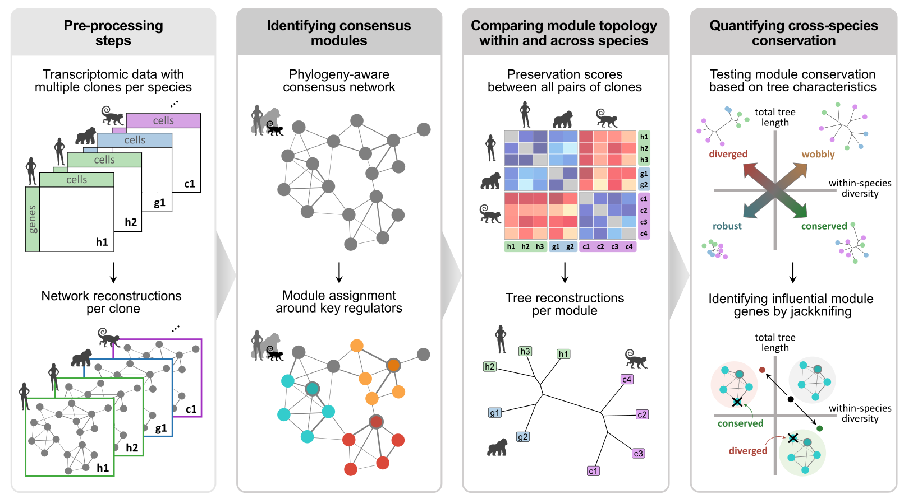

# CroCoNet analyses

This repository contains the code to reproduce all analyses in the
following manuscript:

#### [**CroCoNet: a framework for the quantitative comparison of gene regulatoy networks across species**](https://www.biorxiv.org/content/10.1101/2025.11.18.689002v1)

by Anita Térmeg, Vladyslav Storozhuk, Zane Kliesmete, Fiona C.
Edenhofer, Johanna Geuder, Tamina Dietl, Beate Vieth, Philipp Janssen,
Boyan Bonev, Ines Hellmann

# 

CroCoNet – the framework underlying these analyses – is available as an
[R package](https://github.com/Hellmann-Lab/CroCoNet), accompanied by
[detailed documentation and a step-by-step
tutorial](https://hellmann-lab.github.io/CroCoNet/).

The raw data necessary to reproduce these analyses can be found on
ArrayExpress:

| Accession | Dataset |
|----|----|
| [E-MTAB-15695](https://www.ebi.ac.uk/biostudies/ArrayExpress/studies/E-MTAB-15695) | scRNA-seq data |
| [E-MTAB-13373](https://www.ebi.ac.uk/biostudies/ArrayExpress/studies/E-MTAB-13373) & [E-MTAB-15654](https://www.ebi.ac.uk/biostudies/ArrayExpress/studies/E-MTAB-15654) | ATAC-seq data |

Processed data files have been deposited to Zenodo:

To be able to smoothly run all analyses, please follow these steps:

1.  Start a new R project in a new directory

2.  Clone this Github repository to a subdirectory <tt>scripts</tt>

3.  Download the linked Zenodo repository to a subdirectory
    <tt>data</tt>

### 1. Neural differentiation dataset

The main example data throughout the paper is a scRNA-seq dataset
obtained during the early neural differentiation of human, gorilla and
cynomolgus macaque induced pluripotent (iPS) cell lines. The relevant
scripts to analyze this dataset are the following:

<b>Mapping & QC</b>

&#10;<ul>
  <li><a href="1.neural_differentiation_dataset/1.1.mapping_and_QC/1.1.1.download_ref_genomes.sh">Download the reference genomes</a></li>
  <li><a href="1.neural_differentiation_dataset/1.1.mapping_and_QC/1.1.2.run_liftoff.sh">Create non-human primate annotations using Liftoff</a></li>
  <li><a href="1.neural_differentiation_dataset/1.1.mapping_and_QC/1.1.3.filter_liftoff_gtfs.R">Filter Liftoff annotations</a></li>
  <li><a href="1.neural_differentiation_dataset/1.1.mapping_and_QC/1.1.4.remove_small_contigs.R">Remove small contigs from the gorGor6 genome for quicker mapping</a></li>
  <li><a href="1.neural_differentiation_dataset/1.1.mapping_and_QC/1.1.5.create_STAR_indices.sh">Create STAR indices</a></li>
  <li><a href="1.neural_differentiation_dataset/1.1.mapping_and_QC/1.1.6.download_FASTQ.sh">Download FASTQ files of the scRNA-seq data</a></li>
  <li><a href="1.neural_differentiation_dataset/1.1.mapping_and_QC/1.1.7.trimming.sh">Trim poly-A tails</a></li>
  <li><a href="1.neural_differentiation_dataset/1.1.mapping_and_QC/1.1.8.mapping.sh">Map reads using the zUMIs pipeline</a>
    <ul>
      <li><a href="1.neural_differentiation_dataset/1.1.mapping_and_QC/hg38.yaml">YAML for mapping to the hg38 genome</a></li>
      <li><a href="1.neural_differentiation_dataset/1.1.mapping_and_QC/gorGor6.yaml">YAML for mapping to the gorGor6 genome</a></li>
      <li><a href="1.neural_differentiation_dataset/1.1.mapping_and_QC/macFas6.yaml">YAML for mapping to the macFas6 genome</a></li>
    </ul>
  </li>
  <li><a href="1.neural_differentiation_dataset/1.1.mapping_and_QC/1.1.9.download_cell_type_annotation_ref.sh">Download the cell type annotation reference dataset</a></li>
  <li><a href="1.neural_differentiation_dataset/1.1.mapping_and_QC/1.1.10.QC_and_filtering.R">QC, filtering, normalization, cell type annotation and pseudotime inference</a></li>
</ul>
&#10;

<b>Network inference</b>

&#10;<ul>
  <li><a href="1.neural_differentiation_dataset/1.2.network_inference/1.2.1.prepare_data.R">Prepare input for GRNBoost2</a></li>
  <li><a href="1.neural_differentiation_dataset/1.2.network_inference/1.2.2.create_GRNBoost2_env.sh">Create GRNBoost2 conda environment</a></li>
  <li><a href="1.neural_differentiation_dataset/1.2.network_inference/1.2.3.run_GRNBoost2.sh">Infer networks per replicate using GRNBoost2</a>
    <ul>
      <li><a href="1.neural_differentiation_dataset/1.2.network_inference/arboreto_with_multiprocessing.py">GRNBoost2 network inference worker script</a></li>
    </ul>
  </li>
  <li><a href="1.neural_differentiation_dataset/1.2.network_inference/1.2.4.prepare_data_for_Spearman.R">Prepare input for Spearman's correlation</a></li>
  <li><a href="1.neural_differentiation_dataset/1.2.network_inference/1.2.5.run_correlatePairs.sh">Infer networks per replicate using Spearman's correlation</a>
    <ul>
      <li><a href="1.neural_differentiation_dataset/1.2.network_inference/correlatePairs.R">Spearman's correlation network inference worker script</a></li>
    </ul>
  </li>
</ul>
&#10;

<em>Start here to skip computationally intensive steps and jump to core
analysis</em>

<b>CroCoNet analysis</b>

&#10;<ul>
  <li><a href="1.neural_differentiation_dataset/1.3.CroCoNet_analysis/1.3.1.CroCoNet_analysis.R">Main CroCoNet analysis</a></li>
  <li><a href="1.neural_differentiation_dataset/1.3.CroCoNet_analysis/1.3.2.CroCoNet_analysis_with_top50_pruning.R">CroCoNet analysis using the top50 pruning approach</a></li>
  <li><a href="1.neural_differentiation_dataset/1.3.CroCoNet_analysis/1.3.3.dynamic_VS_top50_pruning.R">Compare results between the dynamic and top50 pruning approaches</a></li>
  <li><a href="1.neural_differentiation_dataset/1.3.CroCoNet_analysis/1.3.4.CroCoNet_analysis_with_cor_adj.R">CroCoNet analysis using cor.adj preservation scores</a></li>
  <li><a href="1.neural_differentiation_dataset/1.3.CroCoNet_analysis/1.3.5.cor_kIM_VS_cor_adj.R">Compare results between the cor.kIM and cor.adj preservation scores</a></li>
  <li><a href="1.neural_differentiation_dataset/1.3.CroCoNet_analysis/1.3.6.CroCoNet_analysis_on_Spearman_networks.R">CroCoNet analysis based on Spearman networks</a></li>
</ul>
&#10;

### 2. Validations

To validate the results of the CroCoNet analysis on the neural
differentiation dataset, we used various additional datasets and
databases. These lines of analysis can be reproduced using the following
scripts:

<b>Regulator interactions and module overlaps</b>

&#10;<ul>
  <li><a href="2.validations/2.1.regulator_interactions_and_module_overlaps/2.1.1.get_regulator_interactions.R">Retrieve protein-protein interactions between the central regulators from STRINGdb</a></li>
  <li><a href="2.validations/2.1.regulator_interactions_and_module_overlaps/2.1.2.calculate_module_overlaps.R">Calculate pairwise module overlaps</a></li>
  <li><a href="2.validations/2.1.regulator_interactions_and_module_overlaps/2.1.3.test_association.R">Test and plot association between regulator interaction and module overlap</a></li>
</ul>
&#10;

<b>Pathway enrichment analysis</b>

&#10;<ul>
  <li><a href="2.validations/2.2.pathway_enrichment/2.2.1.run_Reactome.R">Perform Reactome enrichment analysis for each initial, pruned and random module</a></li>
  <li><a href="2.validations/2.2.pathway_enrichment/2.2.2.summarize_Reactome_results.R">Summarize and plot Reactome results</a></li>
</ul>
&#10;

<b>Binding site enrichment and divergence</b>

&#10;<ul>
  <li><a href="2.validations/2.3.binding_site_enrichment_and_divergence/2.3.1.download_ATAC_seq_FASTQ.sh">Download FASTQ files of the ATAC-seq data</a></li>
  <li><a href="2.validations/2.3.binding_site_enrichment_and_divergence/2.3.2.ATAC_seq_trimming.sh">Trim adapters</a></li>
  <li><a href="2.validations/2.3.binding_site_enrichment_and_divergence/2.3.3.create_bwa_mem2_indices.sh">Create bwa-mem2 indices</a></li>
  <li><a href="2.validations/2.3.binding_site_enrichment_and_divergence/2.3.4.ATAC_seq_mapping.sh">Map ATAC-seq reads using bwa-mem2</a></li>
  <li><a href="2.validations/2.3.binding_site_enrichment_and_divergence/2.3.5.name_sorting.sh">Name-sort BAM files</a></li>
  <li><a href="2.validations/2.3.binding_site_enrichment_and_divergence/2.3.6.peak_calling_without_blacklist.sh">Call peaks using Genrich without blacklists</a></li>
  <li><a href="2.validations/2.3.binding_site_enrichment_and_divergence/2.3.7.create_blacklists.R">Generate blacklists from broad and high-intensity peaks</a></li>
  <li><a href="2.validations/2.3.binding_site_enrichment_and_divergence/2.3.8.peak_calling_with_blacklist.sh">Call peaks using Genrich with blacklists</a></li>
  <li><a href="2.validations/2.3.binding_site_enrichment_and_divergence/2.3.9.liftOver_human_NPC_peaks_to_gorGor6.R">Infer gorilla NPC peaks by liftOver of the human NPC peaks</a></li>
  <li><a href="2.validations/2.3.binding_site_enrichment_and_divergence/2.3.10.download_nanopore_FASTQ.sh">Download FASTQ files of the Nanopore data</a></li>
  <li><a href="2.validations/2.3.binding_site_enrichment_and_divergence/2.3.11.create_minimap2_index.sh">Create minimap2 indices</a></li>
  <li><a href="2.validations/2.3.binding_site_enrichment_and_divergence/2.3.12.nanopore_mapping.sh">Map Nanopore reads using minimap2</a></li>
  <li><a href="2.validations/2.3.binding_site_enrichment_and_divergence/2.3.13.merge_BAMs.sh">Merge Nanopore BAMs per species and cell type</a></li>
  <li><a href="2.validations/2.3.binding_site_enrichment_and_divergence/2.3.14.reconstruct_nanopore_transcripts.sh">Reconstruct Nanopore transcripts using pinfish</a></li>
  <li><a href="2.validations/2.3.binding_site_enrichment_and_divergence/2.3.15.annotate_nanopore_transcripts.R">Annotate Nanopore transcripts</a></li>
  <li><a href="2.validations/2.3.binding_site_enrichment_and_divergence/2.3.16.identify_TSS.R">Identify active transcriptional start sites</a></li>
  <li><a href="2.validations/2.3.binding_site_enrichment_and_divergence/2.3.17.associate_peaks_to_gene.R">Associate peaks to genes based on distance</a></li>
  <li><a href="2.validations/2.3.binding_site_enrichment_and_divergence/2.3.18.get_binding_motifs.R">Retrieve motifs of the central regulators from the JASPAR and IMAGE databases</a></li>
  <li><a href="2.validations/2.3.binding_site_enrichment_and_divergence/2.3.19.run_cbust.sh">Score motifs of each regulator in the peaks associated to their module members using Cluster-Buster</a></li>
  <li><a href="2.validations/2.3.binding_site_enrichment_and_divergence/2.3.20.summarize_motif_scores_per_gene.Rmd">Summarize motif scores per gene</a></li>
</ul>
&#10;
<em>Start here to skip computationally intensive steps and jump to core analysis</em>

&#10;<ul>
  <li><a href="2.validations/2.3.binding_site_enrichment_and_divergence/2.3.21.binding_site_enrichment_across_module_types.R">Compare binding site enrichment across module types (initial, pruned, random)</a></li>
  <li><a href="2.validations/2.3.binding_site_enrichment_and_divergence/2.3.22.binding_site_divergence_across_species.R">Calculate binding site divergence across species</a></li>
</ul>
&#10;

<b>Sequence divergence</b>

&#10;<ul>
  <li><a href="2.validations/2.4.sequence_divergence/2.4.1.download_protein_alignments_and_phastCons_scores.sh">Download protein alignments</a></li>
  <li><a href="2.validations/2.4.sequence_divergence/2.4.2.calculate_sequence_divergence.R">Calculate the human–gorilla and human–cynomolgus AA conservation of the regulators</a>
    <ul>
      <li><a href="2.validations/2.4.sequence_divergence/alignment_scoring_function.R">Helper function for alignment scoring</a></li>
    </ul>
  </li>
  <li><a href="2.validations/2.4.sequence_divergence/2.4.3.calculate_phastCons_scores.R">Calculate the mean phastCons scores of the regulators</a></li>
  <li><a href="2.validations/2.4.sequence_divergence/2.4.4.sequence_divergence_VS_network_divergence.R">Test and plot association between sequence divergence and network divergence</a></li>
</ul>
&#10;

<b>Expression pattern divergence</b>

&#10;<ul>
  <li><a href="2.validations/2.5.expression_pattern_divergence/2.5.1.calculate_expression_pattern_divergence.R">Perform DE analysis of scRNA-seq data</a>
    <ul>
      <li><a href="2.validations/2.5.expression_pattern_divergence/subsampling_helper_function.R">Helper function for subsampling</a></li>
    </ul>
  </li>
  <li><a href="2.validations/2.5.expression_pattern_divergence/2.5.2.expression_pattern_divergence_VS_network_divergence.R">Test and plot association between expression pattern divergence and network divergence</a></li>
</ul>
&#10;

<b>ChIP-seq enrichment</b>

&#10;<ul>
  <li><a href="2.validations/2.6.ChIP_seq_enrichment/POU5F1_ChIP_seq.Rmd">POU5F1 ChIP-seq analysis</a></li>
  <li><a href="2.validations/2.6.ChIP_seq_enrichment/NANOG_ChIP_seq.Rmd">NANOG ChIP-seq analysis</a></li>
  <li><a href="2.validations/2.6.ChIP_seq_enrichment/PAX6_ChIP_seq.Rmd">PAX6 ChIP-seq analysis</a></li>
</ul>
&#10;

<b>Enrichment of LTR7 elements near POU5F1 module members</b>

&#10;<ul>
  <li><a href="2.validations/2.7.POU5F1_LTR7_enrichment/2.7.1.get_LTR7_positions_and_info.R">Collect information about LTR7 elements in the human genome</a></li>
  <li><a href="2.validations/2.7.POU5F1_LTR7_enrichment/2.7.2.calculate_enrichment_near_POU5F1_module_members.R">Calculate LTR7 enrichment near POU5F1 module members</a></li>
</ul>
&#10;

<b>Analysis of POU5F1 single-cell CRISPRi data</b>

&#10;<ul>
  <li><a href="2.validations/2.8.POU5F1_CRISPRi/2.8.1.annotate_dCas9_cassette.R">Annotate dCas9 cassette</a></li>
  <li><a href="2.validations/2.8.POU5F1_CRISPRi/2.8.2.create_ref_genomes_with_dCas9_casette.sh">Create reference genome sequences and annotations with the dCas9 cassette</a></li>
  <li><a href="2.validations/2.8.POU5F1_CRISPRi/2.8.3.download_FASTQ.sh">Download FASTQ files of Perturb-seq data</a></li>
  <li><a href="2.validations/2.8.POU5F1_CRISPRi/2.8.4.mapping.sh">Map reads using CellRanger</a>
    <ul>
      <li><a href="2.validations/2.8.POU5F1_CRISPRi/mapping_per_lane_and_genome.sh">Mapping worker script</a></li>
    </ul>
  </li>
  <li><a href="2.validations/2.8.POU5F1_CRISPRi/2.8.5.species_demultiplexing.sh">Species demultiplexing</a>
    <ul>
      <li><a href="2.validations/2.8.POU5F1_CRISPRi/species_demultiplexing_per_lane_and_genome.sh">Demultiplexing worker script</a></li>
    </ul>
  </li>
  <li><a href="2.validations/2.8.POU5F1_CRISPRi/2.8.6.get_cells_per_species.R">Identify the cells of each species</a></li>
  <li><a href="2.validations/2.8.POU5F1_CRISPRi/2.8.7.individual_demultiplexing.sh">Individual demultiplexing</a>
    <ul>
      <li><a href="2.validations/2.8.POU5F1_CRISPRi/indiv_demultiplexing_per_lane_and_genome.sh">Individual demultiplexing worker script</a></li>
    </ul>
  </li>
  <li><a href="2.validations/2.8.POU5F1_CRISPRi/2.8.8.QC_and_filtering.R">QC & filtering</a></li>
</ul>
&#10;
<em>Start here to skip computationally intensive steps and jump to core analysis</em>

&#10;<ul>
  <li><a href="2.validations/2.8.POU5F1_CRISPRi/2.8.9.stemness_scores_and_knockdown_efficiencies.R">Stemness scores & knockdown efficiencies</a></li>
  <li><a href="2.validations/2.8.POU5F1_CRISPRi/2.8.10.DE_analysis.R">DE analysis</a></li>
  <li><a href="2.validations/2.8.POU5F1_CRISPRi/helper_functions.R">Helper functions</a></li>
</ul>
&#10;

### 3. Brain dataset

As a second, more complex example dataset, we used published snRNA-seq
data of brain samples from five primate species (Jorstad et al. 2023).
This study sampled the middle temporal gyrus of several human, chimp,
gorilla, rhesus macaque and marmoset donors. The following scripts
contain the code to run CroCoNet analysis on this dataset:

<b>Data preparation</b>

&#10;<ul>
  <li><a href="3.brain_dataset/3.1.data_preparation/3.1.1.download_processed_data.sh">Download the count matrices and metadata tables</a></li>
  <li><a href="3.brain_dataset/3.1.data_preparation/3.1.2.filtering.R">Filter data for network analysis</a></li>
  <li><a href="3.brain_dataset/3.1.data_preparation/3.1.3.subsampling.R">Subsample data for network analysis</a></li>
</ul>
&#10;

<b>Network inference</b>

&#10;<ul>
  <li><a href="3.brain_dataset/3.2.network_inference/3.2.1.run_correlatePairs.sh">Infer networks per replicate using Spearman correlations</a>
    <ul>
      <li><a href="3.brain_dataset/3.2.network_inference/correlatePairs.R">Network inference worker script</a></li>
    </ul>
  </li>
</ul>
&#10;

<em>Start here to skip computationally intensive steps and jump to core
analysis</em>

<b>CroCoNet analysis</b>

&#10;<ul>
  <li><a href="3.brain_dataset/3.3.CroCoNet_analysis/3.3.1.CroCoNet_analysis.R">Main CroCoNet analysis</a></li>
  <li><a href="3.brain_dataset/3.3.CroCoNet_analysis/3.3.2.CroCoNet_analysis_with_cor_kIM.R">CroCoNet analysis using cor.kIM preservation scores</a></li>
  <li><a href="3.brain_dataset/3.3.CroCoNet_analysis/3.3.3.cor_kIM_VS_cor_adj.R">Compare results between the cor.kIM and cor.adj preservation scores</a></li>
</ul>
&#10;

### 4. Figures and tables in the manuscript

This directory contains all scripts required to reproduce the figures
and tables featuring in the manuscript.

<b>Main figures</b>

&#10;<ul>
  <li><a href="4.paper_figures_and_tables/figure2.R">Figure 2</a></li>
  <li><a href="4.paper_figures_and_tables/figure3.R">Figure 3</a></li>
  <li><a href="4.paper_figures_and_tables/figure4.R">Figure 4</a></li>
  <li><a href="4.paper_figures_and_tables/helper_functions.R">Helper functions</a></li>
</ul>
&#10;

<b>Supplementary figures</b>

&#10;<ul>
  <li><a href="4.paper_figures_and_tables/suppl.figureS1.R">Supplementary Figure S1</a></li>
  <li><a href="4.paper_figures_and_tables/suppl.figureS2.R">Supplementary Figure S2</a></li>
  <li><a href="4.paper_figures_and_tables/suppl.figureS3.R">Supplementary Figure S3</a></li>
  <li><a href="4.paper_figures_and_tables/suppl.figureS4.R">Supplementary Figure S4</a></li>
  <li><a href="4.paper_figures_and_tables/suppl.figureS5.R">Supplementary Figure S5</a></li>
  <li><a href="4.paper_figures_and_tables/suppl.figureS6.R">Supplementary Figure S6</a></li>
  <li><a href="4.paper_figures_and_tables/suppl.figureS7.R">Supplementary Figure S7</a></li>
  <li><a href="4.paper_figures_and_tables/suppl.figureS8.R">Supplementary Figure S8</a></li>
  <li><a href="4.paper_figures_and_tables/suppl.figureS9.R">Supplementary Figure S9</a></li>
  <li><a href="4.paper_figures_and_tables/suppl.figureS10.R">Supplementary Figure S10</a></li>
  <li><a href="4.paper_figures_and_tables/suppl.figureS11.R">Supplementary Figure S11</a></li>
  <li><a href="4.paper_figures_and_tables/suppl.figureS12_13.R">Supplementary Figure S12–S13</a></li>
  <li><a href="4.paper_figures_and_tables/suppl.figureS14.R">Supplementary Figure S14</a></li>
</ul>
&#10;

<b>Supplementary tables</b>

&#10;<ul>
  <li><a href="4.paper_figures_and_tables/suppl.tables.R">Supplementary Tables 1–10</a></li>
</ul>
&#10;

